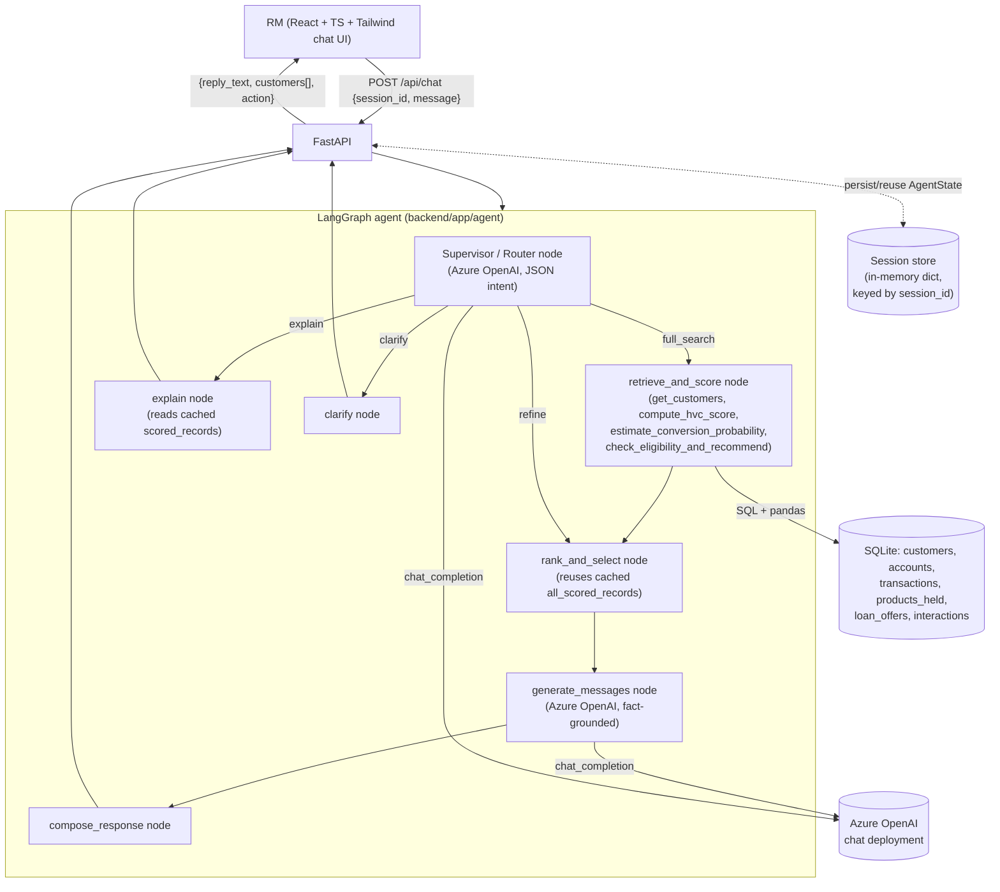

# Agentic AI for Banking CRM

An agentic system that lets a Relationship Manager (RM) ask, in plain language,
*"Find high-value customers likely to convert for a personal loan this month and generate
personalized WhatsApp messages"* — and get back a ranked, explainable shortlist with product
recommendations and grounded outreach drafts.

- **Backend**: Python, FastAPI, LangGraph, Azure OpenAI, SQLite, pandas
- **Frontend**: React + TypeScript + Tailwind CSS (minimal chat UI)

## 1. Architecture



(Source: [docs/architecture.mmd](docs/architecture.mmd) — renders in any Mermaid-aware viewer, e.g. GitHub.)

The system is built as an explicit **state machine**, not a single monolithic prompt. Each RM
message is turned into structured **intent** by a router node, and the graph only runs the nodes
that intent actually needs — a follow-up like *"just the top 5"* re-ranks cached data instead of
re-querying the database and re-scoring 300 customers from scratch.

## 2. Task decomposition

The RM's request decomposes into six discrete, independently-testable steps, each owned by a
plain Python "tool" function (never an LLM) except message generation:

| Step | Tool (`backend/app/tools/`) | What it does |
|---|---|---|
| 1. Retrieve | `customer_data.get_customers` | SQL + pandas join of customers × accounts, filtered by city/segment/excluded products |
| 2. Score value | `scoring.compute_hvc_score` | Percentile-rank weighted score across balance, income, tenure, product depth |
| 3. Score conversion | `scoring.estimate_conversion_probability` | Weighted rule score (salary regularity, recent large spend, loan inquiry, credit band, debt load) or a pluggable ML model |
| 4. Recommend | `recommend.check_eligibility_and_recommend` | Matches income/credit score against `loan_offers`, picks best eligible tier, caps amount |
| 5. Rank & select | `agent/nodes.rank_and_select_node` | Composite score = 0.45×HVC + 0.55×conversion, take top N |
| 6. Generate outreach | `messaging.generate_whatsapp_message` | Azure OpenAI call, grounded on a per-customer JSON fact sheet only |

An **explain** tool (`explain.py`) renders the same scoring breakdown per customer on demand, so
"why was this customer picked" is answerable without re-running the pipeline.

## 3. Execution flow (example)

```
RM: "Find high-value customers likely to convert for a personal loan this month
     and generate personalized WhatsApp messages"
  1. Supervisor parses intent -> {action: full_search, product_type: personal_loan, top_n: 10}
  2. retrieve_and_score: pulls ~300 customers (excluding those who already hold a personal loan),
     computes HVC + conversion scores + eligible product/amount for each
  3. rank_and_select: sorts by composite score, keeps top 10
  4. generate_messages: drafts one WhatsApp message per shortlisted customer, grounded in their
     fact sheet (name, product, amount, one real signal e.g. "asked about loans recently")
  5. compose_response: returns a ranked list + drafts to the RM

RM: "Just show me the top 3 in Mumbai"
  1. Supervisor parses intent -> {action: refine, city: "Mumbai", top_n: 3}
  2. rank_and_select re-filters/re-sorts the SAME cached scored universe (no DB re-query)
  3. generate_messages drafts messages for the new top 3
  4. compose_response returns the narrowed list

RM: "Why was Priya Sharma picked?"
  1. Supervisor parses intent -> {action: explain, target_customer_id: "Priya Sharma"}
  2. explain node resolves the name against the cached result set and renders the scoring
     breakdown (percentiles, which conversion signals fired, eligibility reasoning) — no LLM,
     no re-computation
```

If the RM's very first message in a session is ambiguous (e.g. no product context and none can be
inferred) or refers to a customer not in the current result set, the router returns a
**clarify** action with a specific question instead of guessing.

## 4. Key design decisions

- **LangGraph over an implicit agent loop.** An explicit graph makes the four paths
  (full_search / refine / explain / clarify) inspectable and lets follow-up turns reuse partial
  state — the core "agentic reasoning" demonstration the assignment asks for.
- **Rules-first scoring, ML as an explicit extensibility hook.** Both HVC and conversion scores
  are transparent, weighted rule engines with named constants (`scoring.py`) — auditable, which
  matters in banking. `SCORING_MODE=ml` swaps in a logistic regression
  (`tools/train_model.py`) trained on synthetic labels, to show the upgrade path without
  pretending a production model exists when there's no real historical conversion data.
- **Fact-grounded generation.** `messaging.py` never lets the LLM free-associate about a
  customer — it receives a structured JSON fact sheet and a system prompt that forbids inventing
  anything outside it. This is what keeps "personalized" from becoming "hallucinated."
- **Session state reuse.** `AgentState.all_scored_records` caches the full scored universe from
  the last full search so refine/explain turns are cheap and consistent with what the RM already
  saw, instead of silently re-scoring with fresh randomness.
- **Graceful degradation without an LLM.** Every Azure OpenAI call site (`llm_client.py` callers)
  is wrapped: the supervisor falls back to a safe default intent, and message generation falls
  back to a deterministic template — logged loudly as `fallback_template` — so a demo never hard
  crashes on a missing/invalid API key. Real generation always takes precedence when configured.

## 5. Trade-offs & limitations

- **No real historical conversion labels.** The default conversion score is a documented rules
  engine, not a validated ML model. The included ML path is trained on synthetic, noise-perturbed
  labels purely to demonstrate the plug-in point.
- **WhatsApp send is simulated.** Messages are generated and displayed for RM approval; there is
  no real WhatsApp Business API integration (deliberately out of scope).
- **In-memory session store.** State lives in a process-local dict (`api/session_store.py`) —
  simple for a local demo, but it's lost on restart and won't scale across multiple backend
  workers. Swapping in Redis or a `sessions` table is the natural next step.
- **No auth.** `session_id` is a client-generated token in `localStorage`; there's no RM identity
  or access control layer, which a real deployment would need (e.g. RM should only see their own
  book of customers — the schema already has `rm_id` for this but it isn't enforced yet).
- **Per-customer LLM calls for messaging.** Generating N personalized drafts costs N LLM calls;
  it isn't batched. For a top-10 shortlist this is a non-issue; for hundreds it would need
  batching/streaming.
- **Synthetic data.** All customers/transactions are Faker-generated with deterministic seeding
  (documented signal distributions in `seed_data.py`), not real banking data.

## 6. Project structure

```
banking-crm/
  backend/
    app/
      main.py, config.py, llm_client.py
      db/            schema.sql, database.py, seed_data.py
      tools/          customer_data.py, scoring.py, train_model.py, recommend.py,
                       messaging.py, explain.py
      agent/           state.py, prompts.py, supervisor.py, nodes.py, graph.py
      api/             routes_chat.py, session_store.py
      models/          schemas.py
    tests/           test_tools.py, test_scoring.py, test_agent_graph.py
    requirements.txt, .env.example, pytest.ini
  frontend/
    src/
      components/    ChatWindow.tsx, MessageBubble.tsx, CustomerCard.tsx
      api/            client.ts
      types/           chat.ts
      App.tsx
    .env.example
  docs/architecture.mmd
```

## 7. Setup & run instructions

### Backend

```bash
cd backend
python -m venv .venv
./.venv/Scripts/activate        # Windows; use `source .venv/bin/activate` on macOS/Linux
pip install -r requirements.txt

cp .env.example .env
# edit .env with your Azure OpenAI endpoint/key/deployment name

python -m app.db.seed_data      # seeds ~300 synthetic customers into SQLite
uvicorn app.main:app --reload   # http://localhost:8000
```

Run tests (fully offline — LLM calls are mocked):

```bash
pytest
```

Optional: train the demo ML conversion model (`SCORING_MODE=ml` in `.env`):

```bash
python -m app.tools.train_model
```

### Frontend

```bash
cd frontend
npm install
cp .env.example .env.local      # VITE_API_BASE_URL, defaults to http://localhost:8000
npm run dev                     # http://localhost:5173
```

Open the app, and try:
1. *"Find high-value customers likely to convert for a personal loan this month and generate
   personalized WhatsApp messages"*
2. *"Just show me the top 5 in Mumbai"*
3. Click **"Why this customer?"** on any card.

### Reseeding / resetting demo data

```bash
curl -X POST http://localhost:8000/api/admin/reseed
```
